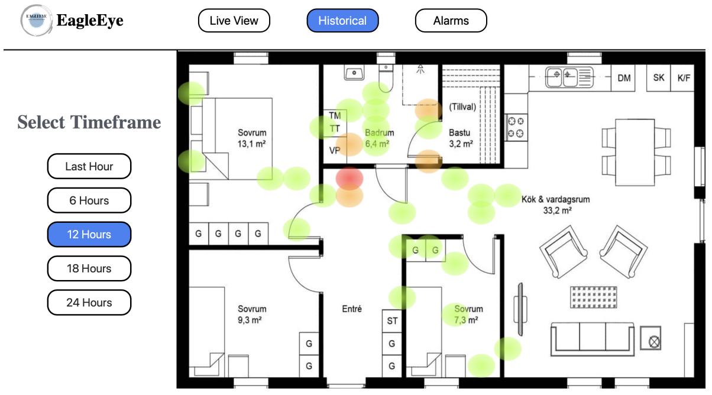
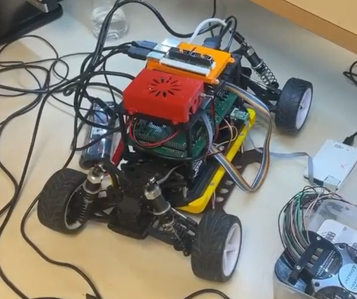
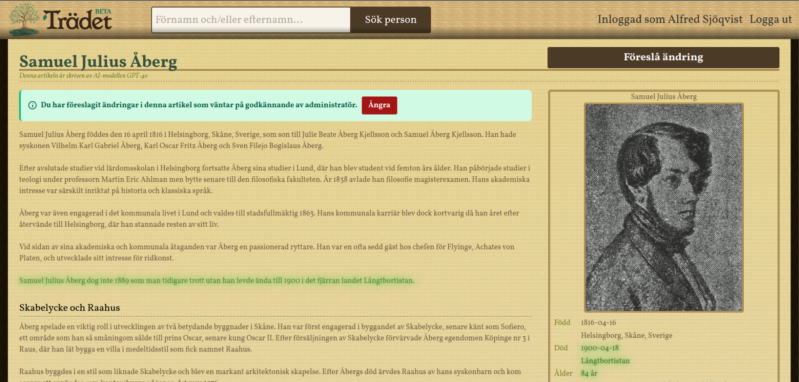
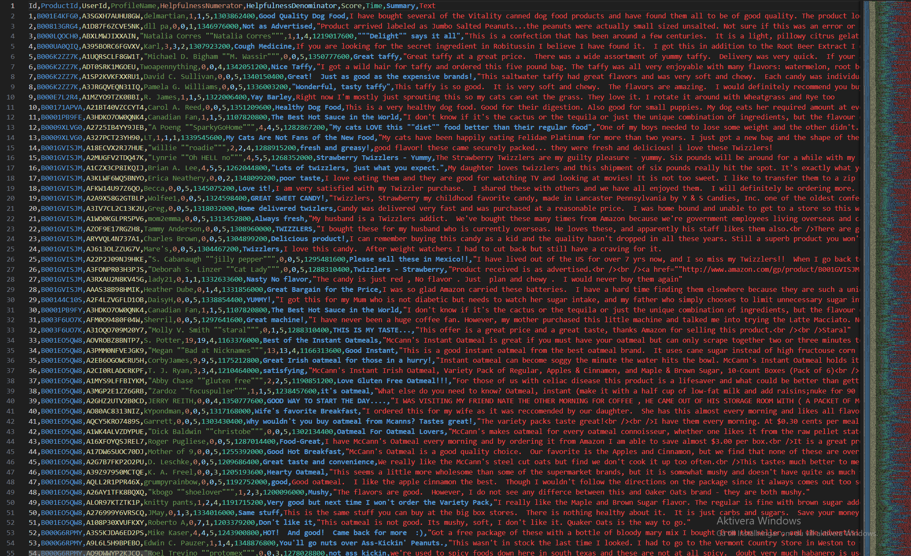

<!-- Top section / intro -->
<table style="width:100%;max-width:900px;border:0;border-spacing:0;border-collapse:separate;margin:0 auto;">
  <tr>
    <td style="padding:0;">
      <table style="width:100%;border:0;border-spacing:0;border-collapse:separate;margin:0 auto;">
        <tr>
          <!-- Text -->
          <td style="padding:2%;width:60%;vertical-align:middle;">
            

              Alfred Sjöqvist
            

            

              Computer engineering and cognitive science student, currently focusing on systems, AI, and secure vision pipelines.
              I like projects where hardware, algorithms, and user experience all meet.
            

            

              Right now I’m especially interested in trustworthy ML, real-time systems, and making complex tools actually usable.
              Always happy to talk about projects, research, or collaborations.
            

            

              <a href="mailto:alfred.sjoqvist@gmail.com" target="_blank">Email</a> &nbsp;/&nbsp;
              <a href="https://www.linkedin.com/in/alfred-sjoqvist" target="_blank">LinkedIn</a> &nbsp;/&nbsp;
              <a href="https://github.com/AlfredSjoqvist" target="_blank">GitHub</a>
            

          </td>

          <!-- Photo -->
          <td style="padding:2.5%;width:40%;max-width:40%;vertical-align:middle;text-align:center;">
            <!-- Replace with your actual headshot -->
            
          </td>
        </tr>
      </table>

      <!-- Divider -->
      

      <!-- Projects header -->
      <table style="width:100%;border:0;border-spacing:0;border-collapse:separate;margin:0 auto;">
        <tr>
          <td style="padding:10px 20px 0 20px;width:100%;vertical-align:bottom;">
            <h2 style="margin-bottom:5px;">Selected Projects</h2>
            

              A few projects I am proud of. Most are work-in-progress and open to contributions.
            

          </td>
        </tr>
      </table>

      <!-- Project list -->
      <table style="width:100%;border:0;border-spacing:0;border-collapse:separate;margin:0 auto;">
        <tbody>

          <!-- EagleEye - A Distributed Security Camera System -->
          <tr>
            <td style="padding:20px;width:25%;vertical-align:middle;text-align:center;">
              
            </td>
            <td style="padding:20px;width:75%;vertical-align:middle;">
              <a href="https://www.diva-portal.org/smash/record.jsf?pid=diva2%3A1973658&dswid=-7574" target="_blank">
                
                  EagleEye - A Distributed Security Camera System
                
              </a>
               
              
                Axis Communications · Bachelor thesis (confidential code, public write-up)
              
              

                A research project investigating secure and privacy-conscious processing of real-time metadata from surveillance cameras. Focuses on designing protected data flows, reliable communication layers, and interactive visualization tools that enable analysis across multiple camera sources without exposing sensitive details.
              

            </td>
          </tr>

          <!-- Cryptocurrency Price Forecasting with Deep Learning -->
          <tr>
            <td style="padding:20px;width:25%;vertical-align:middle;text-align:center;">
              
            </td>
            <td style="padding:20px;width:75%;vertical-align:middle;">
              <a href="https://github.com/AlfredSjoqvist/crypto-price-forecasting" target="_blank">
                
                  Cryptocurrency Price Forecasting with Deep Learning
                
              </a>
              

                Deep learning pipeline for forecasting short-horizon crypto price movements. Includes data preprocessing, engineered indicators, signal denoising, PyTorch models, and quantitative backtesting.
              

            </td>
          </tr>

          <!-- Autonomous Embedded Model Racecar -->
          <tr>
            <td style="padding:20px;width:25%;vertical-align:middle;text-align:center;">
              
            </td>
            <td style="padding:20px;width:75%;vertical-align:middle;">
              <a href="https://github.com/AlfredSjoqvist/autonomous-racecar-embedded" target="_blank">
                
                  Embedded Autonomous Racecar
                
              </a>
              

                Autonomous model-car system integrating embedded C, Rust, Python, and LiDAR processing to achieve real-time mapping, sensing, and control. Designed as a full-stack robotics project with modular architecture covering sensing, actuation, communication, and GUI interaction.
              

            </td>
          </tr>

          <!-- Microcoded Blackjack Computer -->
          <tr>
            <td style="padding:20px;width:25%;vertical-align:middle;text-align:center;">
              
            </td>
            <td style="padding:20px;width:75%;vertical-align:middle;">
              <a href="https://github.com/AlfredSjoqvist/fpga-microcoded-blackjack-cpu" target="_blank">
                
                  Microcoded Blackjack CPU on FPGA
                
              </a>
              

                A fully custom microcoded computer built from scratch on FPGA, complete with assembler, instruction set, memory architecture, and a working Blackjack game.
              

            </td>
          </tr>

          <!-- Trädet: Bridging the Digital Divide by examining Genealogy Platforms -->
          <tr>
            <td style="padding:20px;width:25%;vertical-align:middle;text-align:center;">
              
            </td>
            <td style="padding:20px;width:75%;vertical-align:middle;">
              <a href="https://github.com/AlfredSjoqvist/traedet-genealogy-platform" target="_blank">
                
                  Trädet: Bridging the Digital Divide by examining Genealogy Platforms
                
              </a>
              

                Trädet is a full-stack genealogy platform developed as part of a research project on accessibility and usability in complex data interfaces. Explores interaction design, data modeling, and inclusive UX to reduce barriers for users across the digital divide.
              

            </td>
          </tr>

          <!-- CohSort: Can cohesion measures improve readability by reordering sentences? -->
          <tr>
            <td style="padding:20px;width:25%;vertical-align:middle;text-align:center;">
              
            </td>
            <td style="padding:20px;width:75%;vertical-align:middle;">
              <a href="https://github.com/AlfredSjoqvist/cohsort" target="_blank">
                
                 CohSort: Can cohesion measures improve readability by reordering sentences?
                
              </a>
              

                Research code for CohSort, an NLP system that reorders sentences in news summaries using Coh-Metrix style cohesion metrics (LSA + SBERT + L2) and simulated annealing. Accompanies the paper “Can automatic cohesion measures improve the readability of summaries by reordering their sentences?”.
              

            </td>
          </tr>

          <!-- Amazon Sentiment Analysis -->
          <tr>
            <td style="padding:20px;width:25%;vertical-align:middle;text-align:center;">
              
            </td>
            <td style="padding:20px;width:75%;vertical-align:middle;">
              <a href="https://github.com/AlfredSjoqvist/amazon-sentiment-analysis" target="_blank">
                
                  Amazon Sentiment Analysis
                
              </a>
              

                Sentiment analysis using a custom text preprocessing pipeline and multiple scikit learn classifiers, including logistic regression, Naive Bayes, decision trees, and gradient boosting.
              

            </td>
          </tr>

        </tbody>
      </table>

       
      

        (Images are placeholders &mdash; drop your own screenshots into <code>images/</code> and update the paths.)
      

    </td>
  </tr>
</table>
