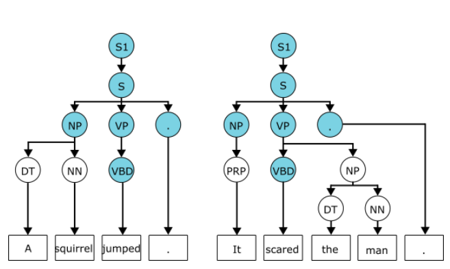

<!-- Top section / intro -->
<table style="width:100%;max-width:900px;border:0;border-spacing:0;border-collapse:separate;margin:0 auto;">
  <tr>
    <td style="padding:0;">
      <table style="width:100%;border:0;border-spacing:0;border-collapse:separate;margin:0 auto;">
        <tr>
          <!-- Text -->
          <td style="padding:2%;width:60%;vertical-align:middle;">
            

              Alfred Sjöqvist
            

            

              Computer engineering and cognitive science student, currently focusing on systems, AI, and secure vision pipelines.
              I like projects where hardware, algorithms, and user experience all meet.
            

            

              Right now I’m especially interested in trustworthy ML, real-time systems, and making complex tools actually usable.
              Always happy to talk about projects, research, or collaborations.
            

            

              <a href="mailto:YOUR_EMAIL_HERE" target="_blank">Email</a> &nbsp;/&nbsp;
              <a href="https://www.linkedin.com/in/YOUR_LINKEDIN_HERE" target="_blank">LinkedIn</a> &nbsp;/&nbsp;
              <a href="https://github.com/AlfredSjoqvist" target="_blank">GitHub</a>
            

          </td>

          <!-- Photo -->
          <td style="padding:2.5%;width:40%;max-width:40%;vertical-align:middle;text-align:center;">
            <!-- Replace with your actual headshot -->
            
          </td>
        </tr>
      </table>

      <!-- Divider -->
      

      <!-- Projects header -->
      <table style="width:100%;border:0;border-spacing:0;border-collapse:separate;margin:0 auto;">
        <tr>
          <td style="padding:10px 20px 0 20px;width:100%;vertical-align:bottom;">
            <h2 style="margin-bottom:5px;">Selected Projects</h2>
            

              A few projects I am proud of. Most are work-in-progress and open to contributions.
            

          </td>
        </tr>
      </table>

      <!-- Project list -->
      <table style="width:100%;border:0;border-spacing:0;border-collapse:separate;margin:0 auto;">
        <tbody>

          <!-- 1. Secure camera / vision systems project -->
          <tr>
            <td style="padding:20px;width:25%;vertical-align:middle;text-align:center;">
              
            </td>
            <td style="padding:20px;width:75%;vertical-align:middle;">
              <a href="https://github.com/AlfredSjoqvist/secure-real-time-vision-systems" target="_blank">
                
                  Secure Real-Time Vision Systems
                
              </a>
               
              
                Axis Communications · Bachelor thesis (confidential code, public write-up)
              
              

                Research project on processing and visualising multi-camera metadata in real time under strict
                security and privacy constraints. Explores secure data flows, timing guarantees, privacy-aware
                aggregation, and human-interpretable visual abstractions for surveillance environments.
              

            </td>
          </tr>

          <!-- 2. Crypto forecasting -->
          <tr>
            <td style="padding:20px;width:25%;vertical-align:middle;text-align:center;">
              
            </td>
            <td style="padding:20px;width:75%;vertical-align:middle;">
              <a href="https://github.com/AlfredSjoqvist/crypto-price-forecasting" target="_blank">
                
                  Crypto Price Forecasting with Deep Learning
                
              </a>
              

                End-to-end PyTorch pipeline for short-horizon Bitcoin prediction. Includes Binance data ingestion,
                technical indicators with <code>pandas_ta</code>, Kalman and wavelet denoising, GRU/LSTM models,
                and backtesting with PnL curves and baseline comparisons.
              

            </td>
          </tr>

          <!-- 3. Autonomous racecar embedded -->
          <tr>
            <td style="padding:20px;width:25%;vertical-align:middle;text-align:center;">
              
            </td>
            <td style="padding:20px;width:75%;vertical-align:middle;">
              <a href="https://github.com/AlfredSjoqvist/autonomous-racecar-embedded" target="_blank">
                
                  Embedded Autonomous Racecar
                
              </a>
              

                Full-stack robotics project combining embedded C/C++, Rust, and Python to control a model racecar.
                Integrates LiDAR processing, mapping, and real-time control loops to drive autonomously through
                cone-based tracks.
              

            </td>
          </tr>

          <!-- 4. FPGA CPU + Blackjack -->
          <tr>
            <td style="padding:20px;width:25%;vertical-align:middle;text-align:center;">
              
            </td>
            <td style="padding:20px;width:75%;vertical-align:middle;">
              <a href="https://github.com/AlfredSjoqvist/fpga-microcoded-blackjack-cpu" target="_blank">
                
                  Microcoded Blackjack CPU on FPGA
                
              </a>
              

                Custom microcoded processor in VHDL with a hand-rolled instruction set, assembler, and memory
                architecture. Demonstrated with a working Blackjack game running entirely on the FPGA.
              

            </td>
          </tr>

          <!-- 5. Genealogy platform -->
          <tr>
            <td style="padding:20px;width:25%;vertical-align:middle;text-align:center;">
              
            </td>
            <td style="padding:20px;width:75%;vertical-align:middle;">
              <a href="https://github.com/AlfredSjoqvist/traedet-genealogy-platform" target="_blank">
                
                  Trädet: Accessible Genealogy Platform
                
              </a>
              

                Full-stack web app for visualising family trees and historical records, designed around Nielsen’s
                usability heuristics and accessibility principles. Built as part of a research project on usable
                genealogy interfaces.
              

            </td>
          </tr>

          <!-- 6. CohSort NLP project -->
          <tr>
            <td style="padding:20px;width:25%;vertical-align:middle;text-align:center;">
              
            </td>
            <td style="padding:20px;width:75%;vertical-align:middle;">
              <a href="https://github.com/AlfredSjoqvist/cohsort" target="_blank">
                
                  CohSort: Cohesion-Aware Sentence Reordering
                
              </a>
              

                Research code for an NLP system that reorders sentences in news summaries using cohesion metrics
                built from LSA, SBERT embeddings, and simulated annealing, exploring how text structure affects
                readability.
              

            </td>
          </tr>

          <!-- 7. Amazon sentiment analysis -->
          <tr>
            <td style="padding:20px;width:25%;vertical-align:middle;text-align:center;">
              
            </td>
            <td style="padding:20px;width:75%;vertical-align:middle;">
              <a href="https://github.com/AlfredSjoqvist/amazon-sentiment-analysis" target="_blank">
                
                  Amazon Review Sentiment Analysis
                
              </a>
              

                Classic NLP pipeline in Python using <code>scikit-learn</code> with custom text preprocessing,
                TF-IDF features, and multiple classifiers (logistic regression, Naive Bayes, decision trees,
                gradient boosting) evaluated on large review data.
              

            </td>
          </tr>

        </tbody>
      </table>

       
      

        (Images are placeholders &mdash; drop your own screenshots into <code>images/</code> and update the paths.)
      

    </td>
  </tr>
</table>
